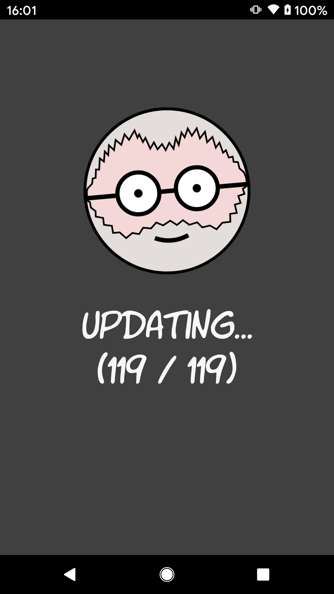
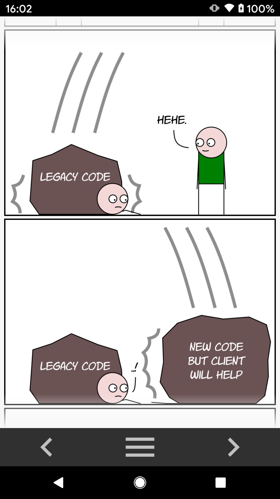
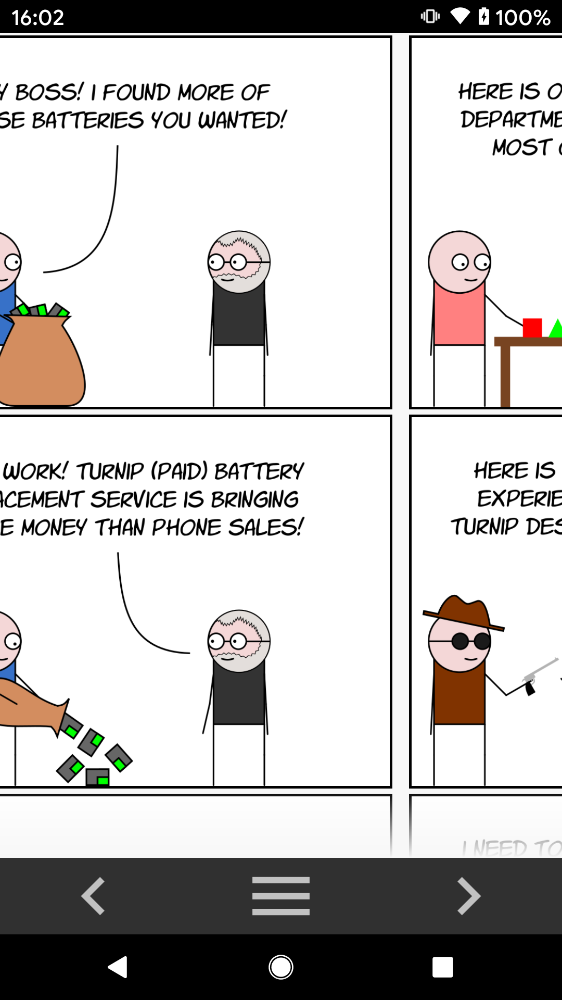
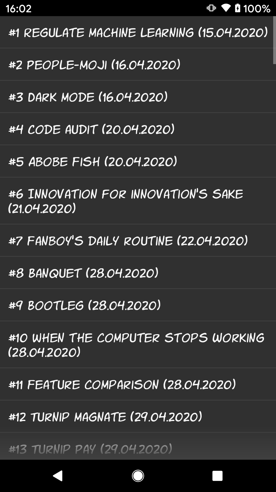

### i am steve kmm
&nbsp;&nbsp;&nbsp;

A Kotlin Multiplatform port of the [i am steve](https://github.com/KamilSucharski/i_am_steve_android) Android App (web comic with offline support).
Running this command might be required before launching: `gradle generateComposeResClass`

Current drawbacks:
  - custom fonts not working (crash)
  - downloaded files stored in cache only
  - no flavors